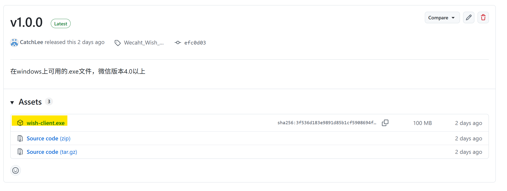
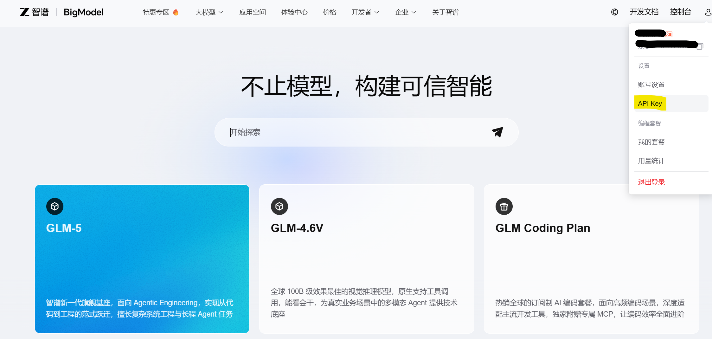
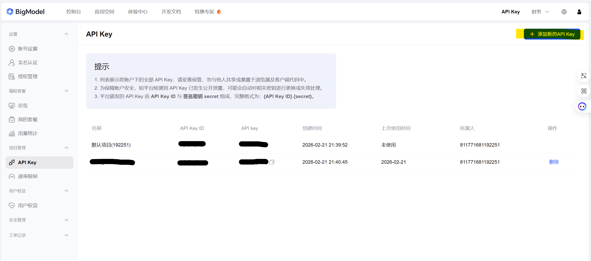
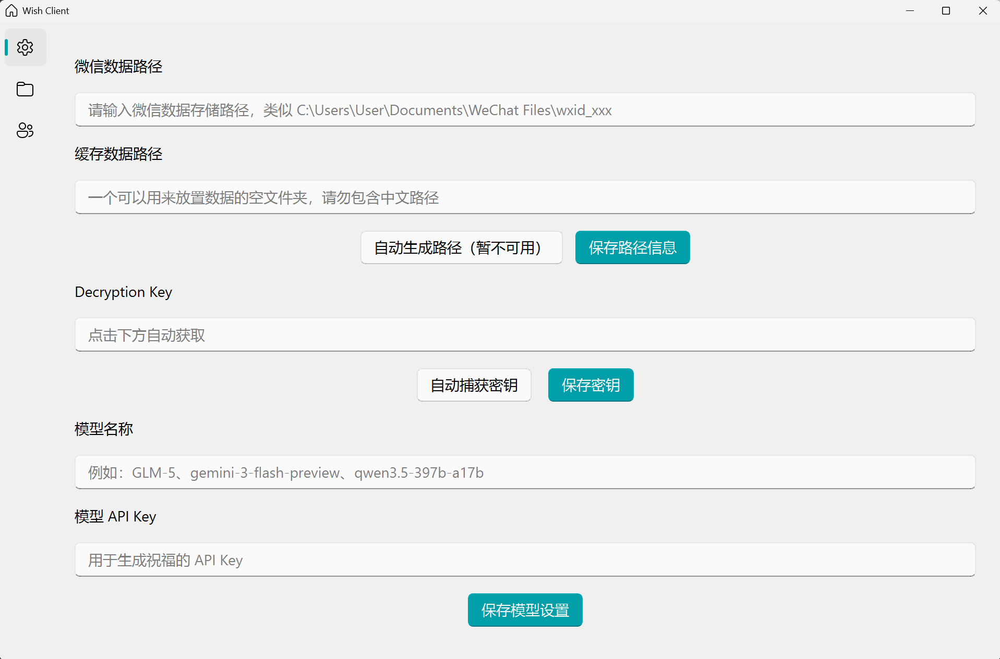
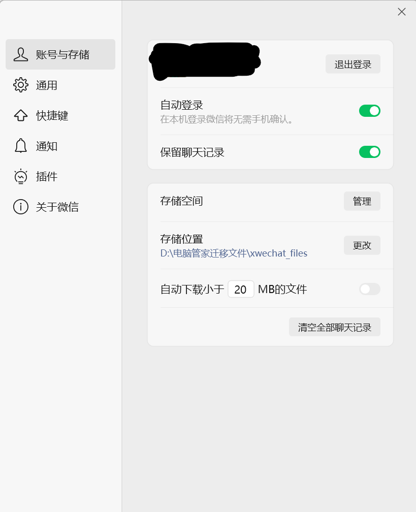
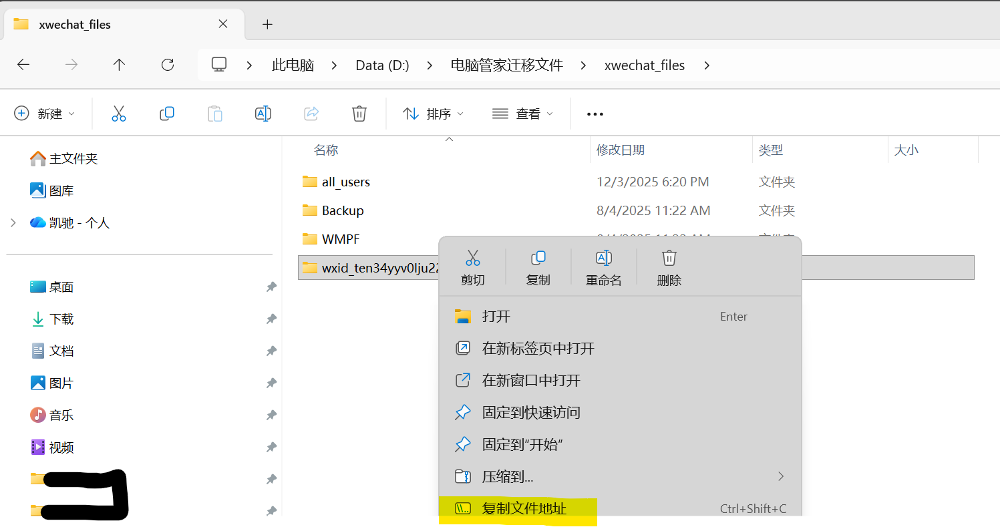
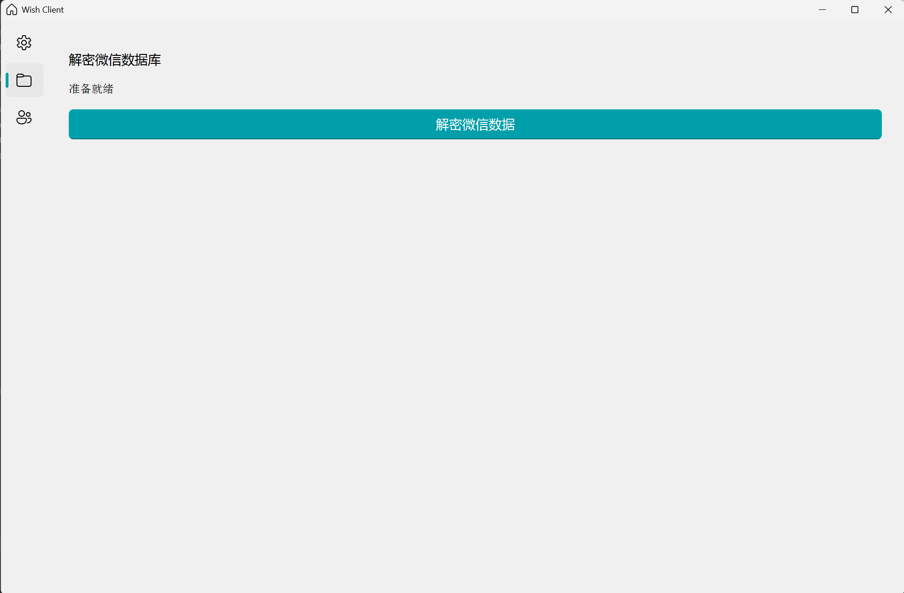
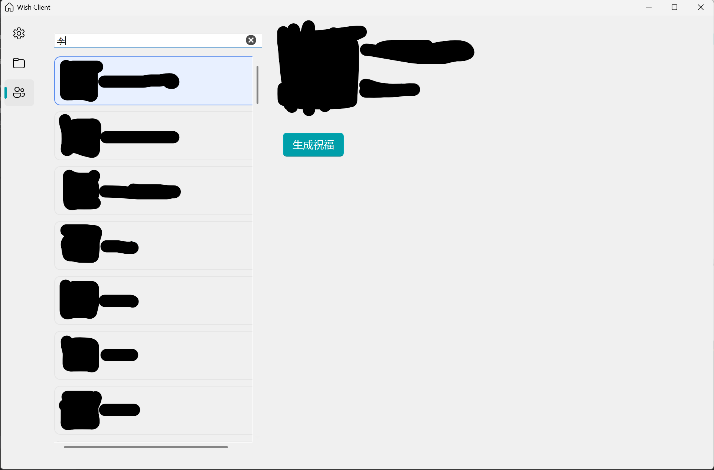

## 目录
1. [Step 1: 文件安装](#step-1-文件安装)
2. [Step 2: API 获取](#step-2-api-获取)
3. [Step 3: 环境变量配置](#step-3-环境变量配置)
4. [Step 4: 数据库解密](#step-4-数据库解密)
5. [Step 5: 祝福生成](#step-5-祝福生成)

---

### Step 1: 文件安装
下载并运行安装程序。

点击查看图文细节

1. 访问https://github.com/CatchLee/wechat_wish_agent/releases/tag/Wecaht_Wish_Client_v1.0.0 ，单击下载`wish-client.exe`，保存到本地任意位置即可。

### Step 2: API 获取
你需要获取大模型的 API Key 才能继续。目前可以在[百炼云平台](https://bailian.console.aliyun.com/)或者[智谱](https://bigmodel.cn/)获取一些免费的Token API。下面以智谱平台为例。

点击查看API申请流程

1. 进入API Key界面

2. 单击"添加新的API Key"。之后需要输入名称，随意输入即可。然后可以复制API Key。

### Step 3: 环境变量配置
这里有五个变量需要设置。目前自动生成文件路径还没有实现，无法使用。

变量设置流程

1. 找到微信基础路径 

2. 在文件资源管理器中进入对应文件夹，然后右键`wxid_`对应的路径，复制文件夹路径，粘贴到`微信数据路径`栏中。

3. 随意选择一个空的文件夹，然后复制文件路径，并粘贴到`缓存数据路径`栏
4. 点击`保存路径信息`
5. 点击自动捕获密钥，按照指示进行。当`Decryption Key`栏有显示密钥时，点击`保存密钥`
6. 输入需要的模型名称和Step2中的API Key。(如果是智谱平台，可以输入`GLM-5`)
7. 点击`保存模型设置`

### Step 4: 解密数据
解密文件。单击右侧文件夹型状按钮，然后点击中间的`解密微信数据`按钮，并稍作等待

### Step 5：生成祝福
进入联系人页面。搜索联系人并生成祝福。注意，由于模型调用时间较长，实际生成一个祝福约1分钟，请耐心等待，不要关闭界面。

详细流程

1. 在搜索框输入用户名称，然后点击搜索。建议名字越精确越好，否则用户过多，渲染图片要较长的时间。
2. 选择要生成祝福的用户，点击`生成祝福`并耐心等待

